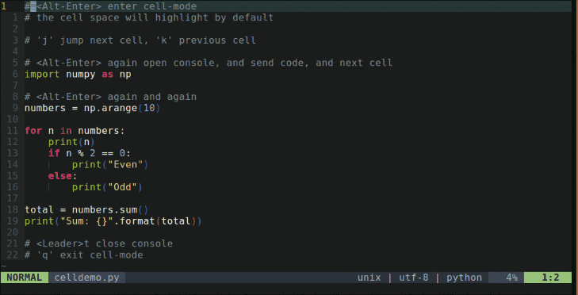

# vim-slime-ipython

<div align=left>

</div>

## Install
#### vim-plug
```vim
Plug 'z-huabao/submode'
Plug 'z-huabao/vim-slime-ipython'
```
#### config
If you don't want to use `cell-mode`: `let g:slime_ipython_no_submode = 1`

And if no highlight the cell space: `let g:slime_ipython_no_highlight = 1`

Use self define kep maps: `let g:slime_ipython_no_mapping = 1`
```vim
" show or hide REPL terminal-console
nnoremap <Leader>t :ToggleConsole<CR>

" cell manager
call submode#MapEnterKeys('cell-mode', ['<M-CR>', '<Leader><Esc>'])
call submode#MapLeaveKeys('cell-mode', ['<CR>', 'q'])
call submode#SetMaps('cell-mode', {
    \ '<M-CR>': ':SendCurrentCellNext<CR>',  " will auto show REPL
    \ 'j': ':NextCell<CR>',
    \ 'k': ':PrevCell<CR>',
    \ 'J': ':MoveCellDown<CR>',
    \ 'K': ':MoveCellUp<CR>',
    \ 'dd': ':CutCurrentCell<CR>',
    \ 'yy': ':CopyCurrentCell<CR>',
    \ })

```

set console-window defalut in right vsplit or bottom split:
```vim
let g:slime_ipython_console_layout = {'position': 'bottom', 'height': 0.3}
" or
let g:slime_ipython_console_layout = {'position': 'right', 'width': 0.5}
```

other REPL setting
```vim
" format: [rpl-shell-command, paste-pre-command, paste-end-command]
let g:slime_ipython_repls = {
    \ 'python': ["ipython3\n", "%cpaste -q\n", "--\n"],
    \ 'sh': ["shell\n", "", ""],
    \ }
```

## Reference
You can take this plugin as [vim-slime](https://github.com/jpalardy/vim-slime) + [vim-ipython-cell](https://github.com/hanschen/vim-ipython-cell)

But there are some difference:
- only support vim-terminal(neovim or vim8) [REPL](https://en.wikipedia.org/wiki/Read%E2%80%93eval%E2%80%93print_loop), not screen, tmux , etc.
- auto start REPL by `<A-Enter>`, and no care console-window is right or bottom.
- diff protocol of [cell](https://jupyter-notebook.readthedocs.io/en/stable/examples/Notebook/Running%20Code.html).

~~~
                                   _
  | import numpy as np              | cell 1
  |                                _|
a | numbers = np.arange(10)         | cell 2
  |                                 |
  |                                _|
b | for n in numbers:               | cell 3
  |     print(n)                   _|
c |     if n % 2 == 0:              |
  |         print("Even")           |
  |     else:                       |
  |         print("Odd")            |
  |                                _|
d | total = numbers.sum()           | cell 5
  | print("Sum: {}".format(total)) _|
~~~
